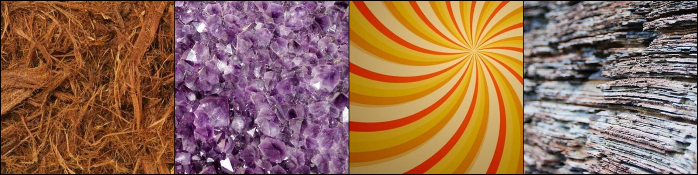
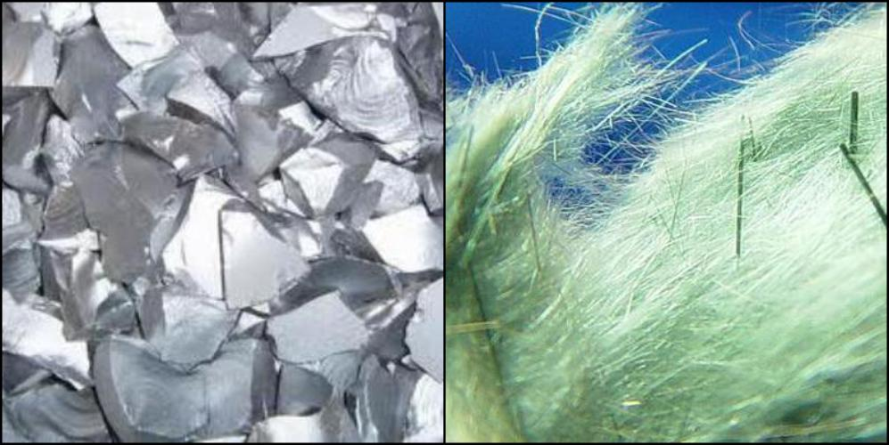
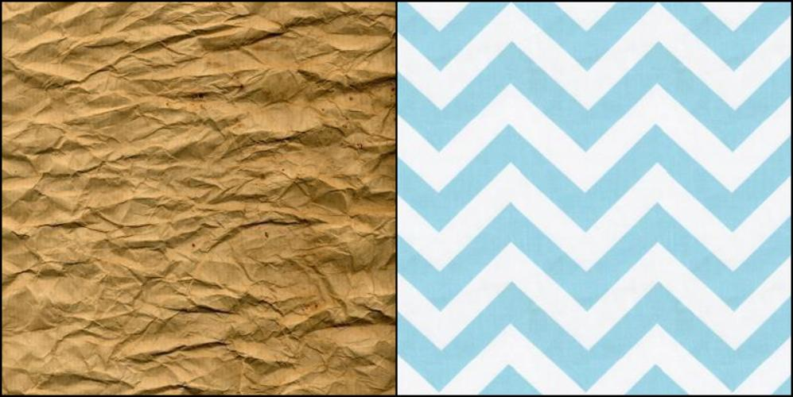
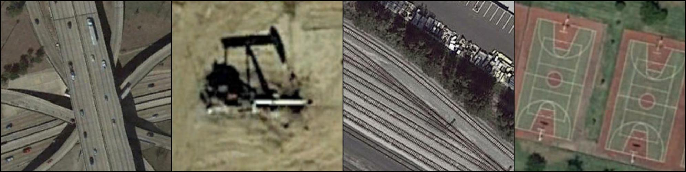
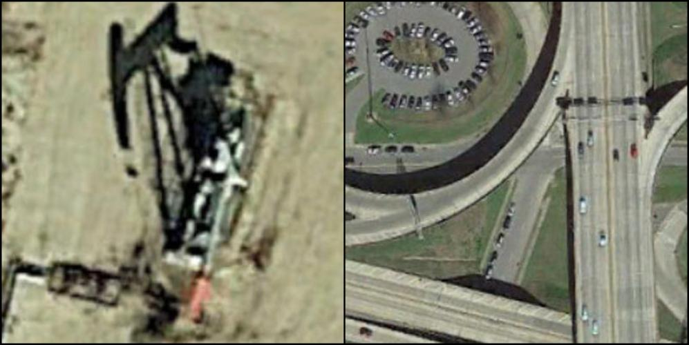
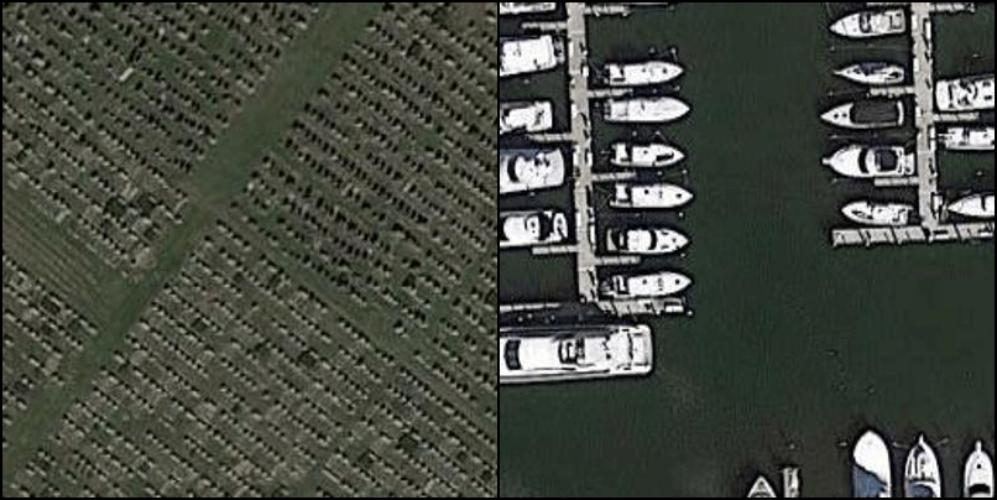
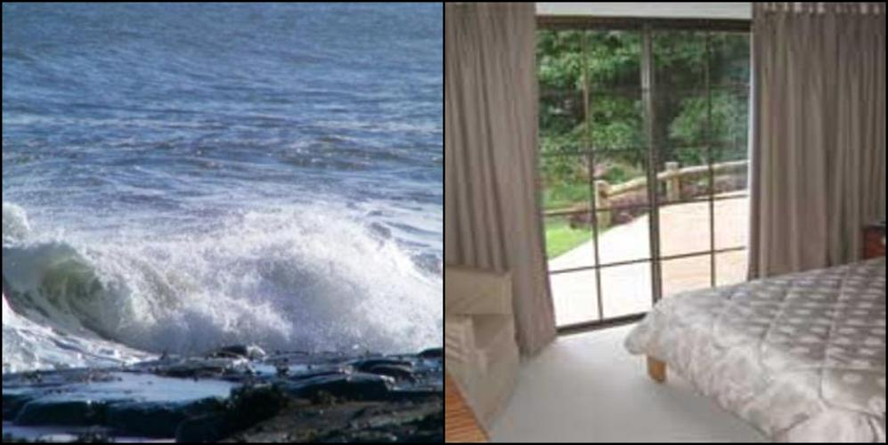
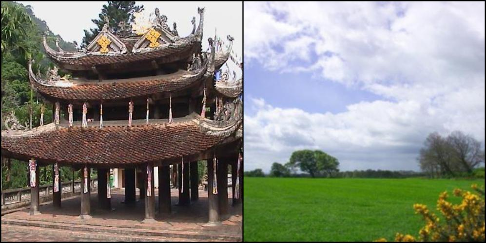

# OOD Detection Benchmark

## Table Of Contents

- [Introduction](#introduction)
- [Data](#data)
- [Setup](#setup)
- [Usage](#usage)
- [Benchmark Tracks](#benchmark-tracks)

## Introduction

The OODDB (OOD Detection Benchmark) is a comprehensive benchmark suite designed to evaluate machine learning models performing
**Out-Of-Distribution Detection**, with a specific focus on its *semantic* aspect (a.k.a. *Semantic Novelty Detection*).
In this task, a model has access to a set of labeled samples (*support set*) that represents the
*known* categories and it has to identify the test samples as either *known* (i.e., belonging to those same classes) or *unknown* (i.e., belogning to other unseen ones).

The benchmark includes datasets depicting different kind of subjects (generic objects, textures, scenes, aerial views), with multiple levels of granularity and across different visual domains.\
In particular, it's designed to test the models both in a **_cross-domain_** and **_intra-domain_** scenario (i.e., with or without a visual domain shift between the support and test distributions), aiming at
an evaluation which is solely centered on the semantic concepts represented by the datasets categories.
The *cross-domain* settings can be further divided into **_single-source_** or **_multi-source_**, depending on whether the labeled data samples belong to one or multiple domains.

We report some visual examples for the supported tracks below (see [Data](#data) for more details): 

**Intra-domain**:

| Dataset | Train (Support) | Test Known | Test Unknown |
| :-: | :-: | :-: | :-: |
| DomainNet Real |  |  |  |
| DTD |  |  |  |
| PatternNet |  |  |  |
| Stanford Cars |  |  |  |
| SUN |  |  |  |

**Cross-domain (single and multi-source)**:

| Dataset | Train (Support) | Test Known | Test Unknown |
| :-: | :-: | :-: | :-: |
| Real &rarr; Painting |  |  |  |
| All &rarr; Painting |  |  |  |

## Data

The benchmark includes the following datasets:
- [DomainNet](./DATASETS.md#domainnet)
  ([paper](https://arxiv.org/pdf/1812.01754.pdf),
  [website](http://ai.bu.edu/M3SDA/), per-domain downloads:
  [clipart](http://csr.bu.edu/ftp/visda/2019/multi-source/groundtruth/clipart.zip),
  [infograph](http://csr.bu.edu/ftp/visda/2019/multi-source/infograph.zip),
  [painting](http://csr.bu.edu/ftp/visda/2019/multi-source/groundtruth/painting.zip),
  [quickdraw](http://csr.bu.edu/ftp/visda/2019/multi-source/quickdraw.zip),
  [real](http://csr.bu.edu/ftp/visda/2019/multi-source/real.zip),
  [sketch](http://csr.bu.edu/ftp/visda/2019/multi-source/sketch.zip)):\
  *intra-domain* settings: 6\
  *cross-domain* settings: 36 (30 *single-source* and 6 *multi-source*)
- [DTD](./DATASETS.md#dtd)
  ([paper](https://www.robots.ox.ac.uk/~vgg/publications/2014/Cimpoi14/cimpoi14.pdf),
  [website](https://www.robots.ox.ac.uk/~vgg/data/dtd/),
  [download](https://www.robots.ox.ac.uk/~vgg/data/dtd/download/dtd-r1.0.1.tar.gz)):\
  *intra-domain* settings: 1
- [PatternNet](./DATASETS.md#patternnet)
  ([paper](https://faculty.ucmerced.edu/snewsam/papers/Zhou_ISPRS18_Patternet.pdf),
  [website](https://sites.google.com/view/zhouwx/dataset#h.p_Tgef10WTuEFr),
  [download](https://nuisteducn1-my.sharepoint.com/:u:/g/personal/zhouwx_nuist_edu_cn/EYSPYqBztbBBqS27B7uM_mEB3R9maNJze8M1Qg9Q6cnPBQ?e=MSf977)):\
  *intra-domain* settings: 1
- [Stanford Cars](./DATASETS.md#stanford-cars)
  ([paper](https://ai.stanford.edu/~jkrause/papers/fgvc13.pdf),
  [kaggle](https://www.kaggle.com/datasets/jessicali9530/stanford-cars-dataset),
  [download](https://www.kaggle.com/datasets/jessicali9530/stanford-cars-dataset/download?datasetVersionNumber=2)):\
  *intra-domain* settings: 1
- [SUN](./DATASETS.md#sun)
  ([paper](https://vision.princeton.edu/projects/2010/SUN/paper.pdf),
  [website](https://vision.princeton.edu/projects/2010/SUN/),
  [download](http://vision.princeton.edu/projects/2010/SUN/SUN397.tar.gz)):\
  *intra-domain* settings: 1

We provide train and test splits for each dataset. 
A train split represents the ID (*in-distribution*) data (i.e., the *known* classes), thus, it only contains a subset of the categories of the corresponding test split (which instead includes both ID and OOD samples).\
More specifically, for each dataset we performed 3 different random divisions of its categories into *known* (ID) and *unknown* (OOD) ones. We refer to these 3 splits as **_data orders_** and we provide a train-test split for each one of them.
(In order to increase the statistical revelance of the results, it is advisable to
repeat the evaluation for all 3 *data orders* in the given setting and to average the obtained values.)

For more information, see [DATASETS.md](./DATASETS.md).

## Setup

You can easily access the benchmark splits by installing the OODDB package via pip:
```shell
pip install git+https://github.com/ooddb/OODDB.git
```

By default, the on-disk datasets root folder locations are read from the `~/.ooddb/config.json` file, which is automatically created and populated with the default values if it doesn't exist yet:
```json
{
  "domainnet": "~/data/DomainNet",
  "dtd": "~/data/DTD",
  "patternnet": "~/data/PatternNet",
  "stanford_cars": "~/data/Stanford_Cars",
  "sun": "~/data/SUN397",
}
```
You can specify any value you prefer or overrride the dataset location by providing it at run-time (see [below](#usage)).

All the datasets are expected to be stored in their default format/layout (see [DATASETS.md](./DATASETS.md)).

## Usage

The `OODDB` package exposes a single `Dataset` class which accepts different dataset and split names
to access the desired data.

Usage example:
```python
from torchvision import transforms
from OODDB import Dataset

dataset = Dataset(
    dataset_name="sun",
    split="train",
    order=0,
    root_dir="~/data/my_folder",
    transform=transforms.ToTensor()
)
```

Specifically, the `Dataset` class accepts the following parameters:
- `dataset_name`: the name of the desired dataset. The supported values are:
  - `domainnet` for DomainNet
  - `dtd` for DTD
  - `patternnet` for PatternNet
  - `stanford_cars` for Stanford Cars
  - `sun` for SUN
- `split`: the name of the desired split.
  - DomainNet accepts `<domain>_train`, `<domain>_test` or `no_<domain>_train`,
    where `<domain>` must be one among `clipart`, `infograph`, `painting`, `quickdraw`, `real` and `sketch`.
  - All the other datasets only accept either `train` or `test`.
- `order`: one of the three *data orders* provided for the selected dataset. Must be a value between 0 and 2 (inclusive). (**WARNING**: each *data order* is not compatible with the others as the class ids differ for each one of them. Use the same `order` value for both the train and test splits.)
- `root_dir`: the dataset root location on disk. If not specified, the value from `~/.ooddb/config.json` will be used.
- `transform`: a function/transform to be applied to a `PIL` `Image`.

For more details, see [dataset.py](./OODDB/dataset.py).

If you prefer to use your own `Dataset` class instead, you can utilize the `OODDB.utils.get_dataset_split_info` function to retrieve the necessary information. Example:
```python
from OODDB.utils import get_dataset_split_info

file_names, labels, class_idx_to_name = get_dataset_split_info(
    dataset="sun",
    split="train",
    data_order=0
)
```

## Benchmark Tracks

The benchmark supports the two following tracks:

### Intra-domain

In this case the train and test samples are drawn from the same visual data distribution.
This is the only configuration supported by all the datasets but DomainNet.
As for the latter, you can execute this track by selecting the same domain for
both the train and test data.

Example (DTD):
```python
from OODDB import Dataset

DATASET="dtd"
DATA_ORDER=0

train_dataset = Dataset(DATASET, split="train", order=DATA_ORDER)
test_dataset = Dataset(DATASET, split="test", order=DATA_ORDER)
```

Example (DomainNet Painting):
```python
from OODDB import Dataset

DATASET="domainnet"
DATA_ORDER=0

train_dataset = Dataset(DATASET, split="painting_train", order=DATA_ORDER)
test_dataset = Dataset(DATASET, split="painting_test", order=DATA_ORDER)
```

### Cross-domain

In this case the train and test samples are drawn from different visual data
distributions. This track is only supported by DomainNet and can be further divided
into **_single-source_** (all the train samples belong to the same single domain)
and **_multi-source_** (the train samples are drawn from several different domains, disjoint from the test one). In both cases the test samples belong to a single domain (i.e., both settings are **_single-target_**).

In order to execute this track, do the following:
- **single-source**: select two different domains for the train and test splits.\
  Example (Clipart &rarr; Sketch):
  ```python
  from OODDB import Dataset

  DATASET="domainnet"
  DATA_ORDER=0

  train_dataset = Dataset(DATASET, split="clipart_train", order=DATA_ORDER)
  test_dataset = Dataset(DATASET, split="sketch_test", order=DATA_ORDER)
  ```
- **multi-source**: select `no_<domain>` for the train split and and `<domain>` for the test one.\
  Example (Quickdraw):
  ```python
  from OODDB import Dataset

  DATASET="domainnet"
  DATA_ORDER=0

  train_dataset = Dataset(DATASET, split="no_quickdraw_train", order=DATA_ORDER)
  test_dataset = Dataset(DATASET, split="quickdraw_test", order=DATA_ORDER)
  ```
